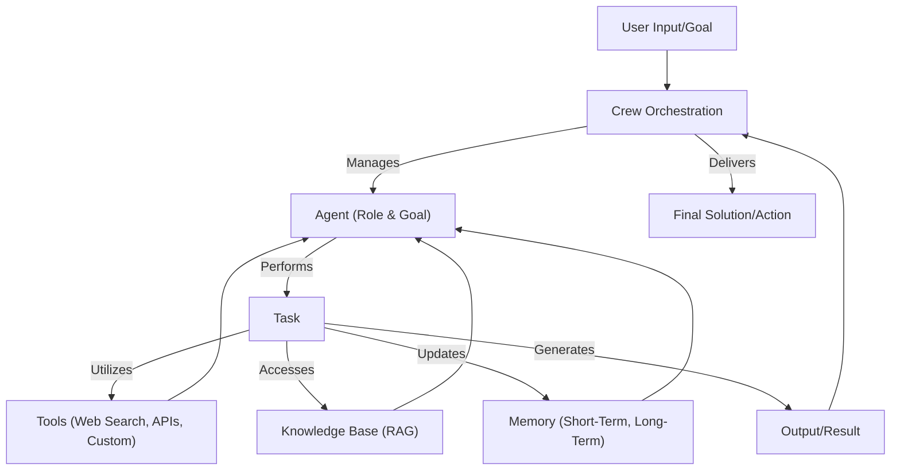

# 🚀 crewAI: Build & Orchestrate Autonomous AI Agents

<p align="center">
  
</p>

## Short Description
crewAI is a powerful, cutting-edge framework designed to empower developers and researchers to build, orchestrate, and manage autonomous AI agents (crews) that can collaboratively solve complex tasks. By fostering seamless cooperation among intelligent agents, crewAI revolutionizes the way we approach AI-driven automation, knowledge management, and problem-solving, enabling teams to achieve unprecedented levels of efficiency and innovation.

## ✨ Key Features
*   **Intelligent Agent Orchestration**: Design and deploy dynamic crews of AI agents that can work together, delegate tasks, and refine their outputs through collaborative processes (sequential or hierarchical).
*   **Customizable Agents**: Define agents with specific roles, goals, backstories, and tailored Large Language Models (LLMs) to ensure optimal performance and specialized expertise for any given task.
*   **Advanced Tool Integration**: Seamlessly integrate a vast array of tools, from web scraping and search to custom AI/ML models, empowering agents to interact with the real world and leverage external capabilities.
*   **Robust Memory Management**: Implement sophisticated memory structures (contextual, entity, short-term, long-term) to enable agents to learn, adapt, and retain information across tasks and sessions.
*   **Knowledge Base (RAG) Support**: Equip agents with rich knowledge bases and Retrieval-Augmented Generation (RAG) capabilities, ensuring they operate with up-to-date and relevant information.
*   **Flexible Workflow Definitions**: Easily define complex multi-agent workflows, allowing for conditional task execution, human-in-the-loop interventions, and asynchronous operations.
*   **Observability & Evaluation**: Monitor agent behavior, track execution traces, and evaluate performance with integrated observability tools, facilitating iterative improvement and reliability.
*   **CLI for Rapid Development**: Boost productivity with a comprehensive Command Line Interface (CLI) for creating, running, and managing your crews and flows.
*   **Extensible LLM Backends**: Connect to a variety of LLMs, including OpenAI, Ollama, and Google Gemini, providing flexibility and control over your AI infrastructure.

## Who is this for?
crewAI is ideal for:
*   **AI/ML Developers**: Looking to build and deploy sophisticated multi-agent systems.
*   **Researchers**: Exploring agent collaboration, emergent behavior, and advanced AI architectures.
*   **Software Architects**: Designing intelligent automation solutions and workflow engines.
*   **Teams & Enterprises**: Seeking to leverage AI for complex problem-solving, data analysis, content generation, and operational efficiency through autonomous workflows.

## Technology Stack & Architecture
crewAI is primarily built in **Python**, leveraging modern AI paradigms and a modular architecture. It integrates with various Large Language Models (LLMs) and provides connectors for vector databases and other tools to facilitate its advanced features. The project utilizes a CLI for easy interaction and structured configurations (`.yaml` files) for defining agents, tasks, and crews.

## 📊 Architecture & Database Schema
Below is a simplified architectural overview illustrating the core components and flow within a typical crewAI setup:



## ⚡ Quick Start Guide
To get started with `crewAI`, ensure you have Python 3.9+ installed.

1.  **Install crewAI:**
    ```bash
    pip install crewai
    ```

2.  **Set up your environment variables** (e.g., `OPENAI_API_KEY` for OpenAI models, or configure other LLMs).

3.  **Create your first crew:**
    ```bash
    crewai create crew my_new_crew
    ```
    This command will scaffold a new project with example agents, tasks, and a crew definition.

4.  **Run your crew:**
    Navigate into your new crew's directory and execute:
    ```bash
    python main.py
    ```
    Follow the prompts and watch your AI agents collaborate!

For detailed documentation and advanced configurations, please refer to the `docs/` directory.

## 📜 License
This project is licensed under the MIT License. See the [LICENSE](LICENSE) file for details.
