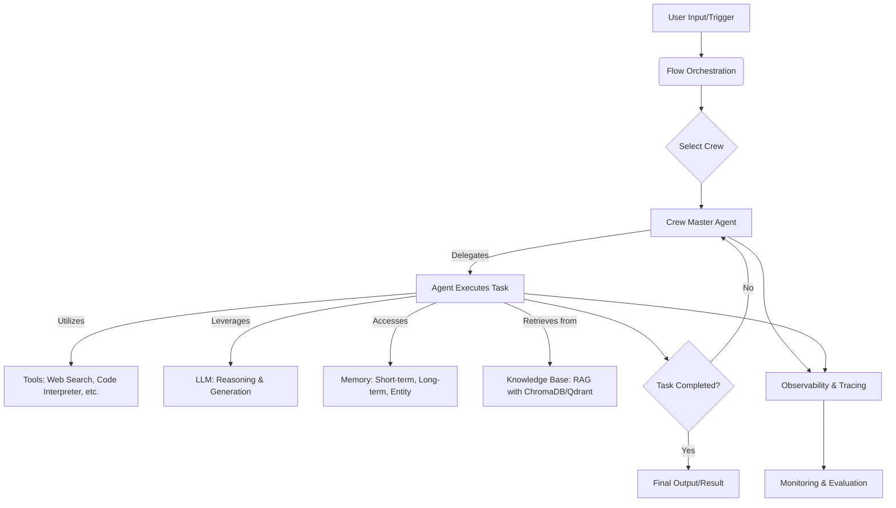

# 🚀 CrewAI

<p align="center"></p>

## Short Description
Unleash the power of autonomous collaboration with **CrewAI**, a groundbreaking framework designed to orchestrate intelligent AI agents into high-performing teams. This powerful toolkit empowers developers to build sophisticated AI workflows where agents collaborate seamlessly, delegate tasks, share knowledge, and execute complex objectives with unparalleled efficiency and precision. From content generation to intricate research, CrewAI transforms single-agent tasks into dynamic, multi-agent processes, pushing the boundaries of what's possible with AI.

## ✨ Key Features

*   **Intelligent Agent Orchestration:** Define and manage autonomous AI agents with distinct roles, goals, and backstories, fostering a dynamic environment for collaborative problem-solving.
*   **Flexible Process Flows:** Implement sequential or hierarchical task execution, enabling agents to delegate work, receive feedback, and refine outcomes through iterative collaboration.
*   **Integrated Tool Utilization:** Equip agents with a diverse array of tools (e.g., web scraping, search, code interpretation, data analysis) to interact with the real world and retrieve relevant information.
*   **Memory Management:** Leverage both short-term (contextual) and long-term (external, entity) memory systems to enable agents to learn, adapt, and maintain continuity across tasks.
*   **Knowledge Retrieval (RAG):** Seamlessly integrate Retrieval Augmented Generation (RAG) capabilities with ChromaDB and Qdrant support, providing agents with access to vast knowledge bases.
*   **LLM Flexibility:** Connect to a wide range of Large Language Models, including custom implementations, to power your agents' reasoning and generation capabilities.
*   **Observability & Tracing:** Gain deep insights into agent behavior and task execution with robust tracing and event-driven logging, supporting integrations with platforms like Langfuse, MLflow, and OpenLit.
*   **Guardrails & Evaluation:** Implement hallucination guardrails and utilize evaluation metrics to ensure agent outputs are accurate, relevant, and aligned with desired standards.
*   **Command-Line Interface (CLI):** Accelerate development with a user-friendly CLI for scaffolding new projects, managing crews, and deploying workflows.
*   **Multimodal Capabilities:** Enable agents to process and generate various data types, enhancing their understanding and interaction with diverse information.

## Who is this for?
CrewAI is perfect for **software developers, AI engineers, researchers, and product teams** looking to:
*   Automate complex, multi-step processes that require reasoning and collaboration.
*   Build next-generation AI applications with autonomous capabilities.
*   Streamline workflows such as market research, content creation, data analysis, and strategic planning.
*   Experiment with advanced agentic systems and explore the frontiers of AI.
*   Integrate AI into existing enterprise systems with robust monitoring and control.

## Technology Stack & Architecture

CrewAI is built predominantly in **Python**, leveraging its rich ecosystem for AI and automation.

*   **Core Language:** Python
*   **AI/ML:** Foundation Models (LLMs), Retrieval Augmented Generation (RAG)
*   **Vector Databases:** ChromaDB, Qdrant
*   **Observability:** Integration with various tracing and logging tools (e.g., Langfuse, MLflow, OpenLit)
*   **CLI Framework:** Custom implementation for project scaffolding and management
*   **Workflow Engine:** Event-driven architecture for orchestrating agents and tasks.
*   **Tools:** Highly modular design supporting a wide array of specialized tools for diverse interactions.

## 📊 Architecture & Database Schema

The core of CrewAI revolves around the dynamic interaction of **Crews**, **Agents**, and **Tasks**, orchestrated through defined **Flows**. This architecture facilitates complex problem-solving through a collaborative paradigm.



## ⚡ Quick Start Guide

Get your first intelligent crew up and running in minutes!

1.  **Installation:**

    ```bash
    pip install crewai
    ```

2.  **Set Up Your Environment:**

    Ensure you have your OpenAI API key (or chosen LLM provider's key) configured as an environment variable:
    ```bash
    export OPENAI_API_KEY='YOUR_API_KEY'
    ```

3.  **Create Your First Crew:**

    ```python
    from crewai import Agent, Task, Crew, Process

    # Define your agents
    researcher = Agent(
        role='Senior Research Analyst',
        goal='Uncover groundbreaking insights from various data sources',
        backstory='A seasoned analyst who excels at synthesizing complex information.',
        verbose=True,
        allow_delegation=False
    )
    writer = Agent(
        role='Professional Content Writer',
        goal='Craft compelling narratives based on research findings',
        backstory='A wordsmith with a talent for transforming raw data into engaging stories.',
        verbose=True,
        allow_delegation=False
    )

    # Define your tasks
    task1 = Task(
        description='Identify the top 5 disruptive technologies in 2024.',
        agent=researcher
    )
    task2 = Task(
        description='Write a compelling blog post on the selected technologies, focusing on their potential impact.',
        agent=writer
    )

    # Instantiate your crew
    tech_crew = Crew(
        agents=[researcher, writer],
        tasks=[task1, task2],
        process=Process.sequential, # Tasks executed one after another
        verbose=2
    )

    # Kickoff the crew's work
    result = tech_crew.kickoff()
    print("Crew work finished:")
    print(result)
    ```

## 📜 License
This project is licensed under the MIT License. See the [LICENSE](LICENSE) file for more details.