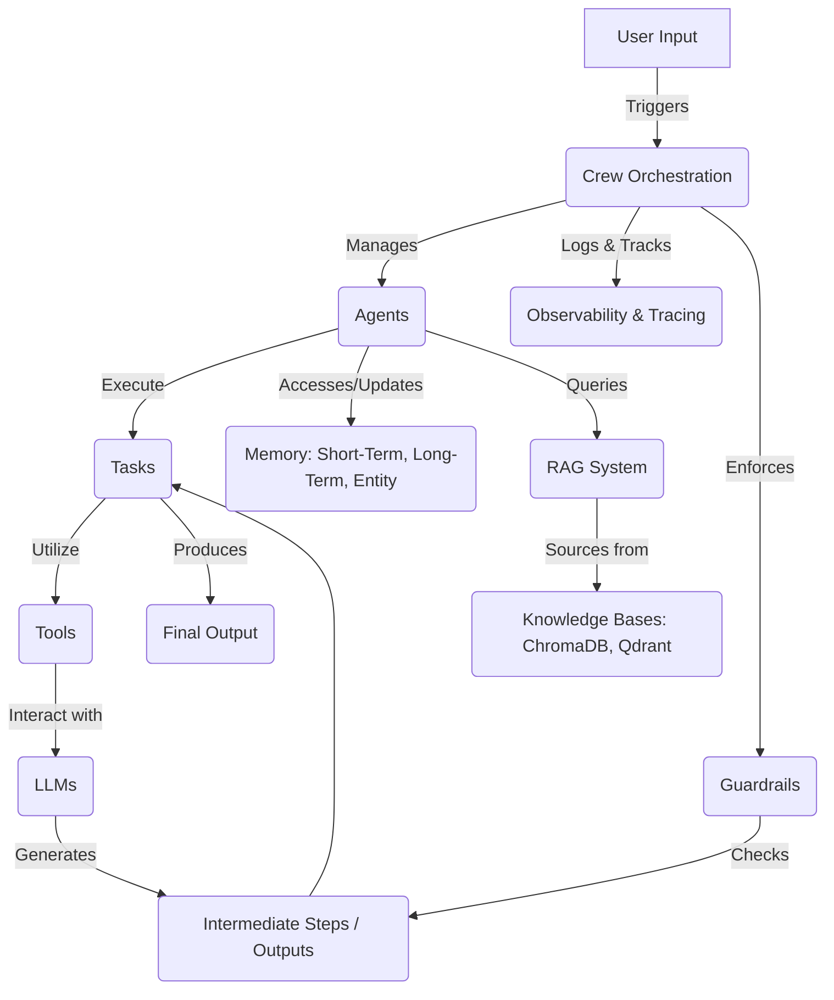

# 🚀 crewAI: The OS for AI Agentic Teams

<p align="center"></p>

Unleash the full potential of AI by orchestrating intelligent, collaborative AI agents. `crewAI` is a cutting-edge framework designed for developers to build, manage, and scale autonomous AI teams that work together seamlessly, tackling complex tasks and driving innovation. From content creation to strategic planning, `crewAI` empowers you to automate multi-step processes with unparalleled precision and efficiency.

## Short Description
`crewAI` is a powerful framework for orchestrating roles, goals, and tools for AI agents to collaborate and execute tasks autonomously. It enables the creation of sophisticated AI workflows, allowing agents to share information, delegate responsibilities, and work together to achieve complex objectives, powered by various LLMs and robust memory management.

## ✨ Key Features
*   **Multi-Agent Orchestration:** Define and manage teams of AI agents with distinct roles, goals, and backstories for dynamic collaboration.
*   **Flexible Task Management:** Assign tasks to individual agents or entire crews, supporting sequential, hierarchical, and even custom process flows.
*   **Integrated Tool Usage:** Equip agents with a rich set of tools (custom or pre-built) to interact with external systems and extend their capabilities.
*   **Advanced Memory Management:** Leverage contextual, short-term, long-term, and entity memory for agents to retain and recall information across interactions.
*   **Retrieval Augmented Generation (RAG):** Integrate knowledge bases (ChromaDB, Qdrant, custom) for agents to access and utilize external information efficiently.
*   **LLM Agnostic:** Seamlessly connect with various Large Language Models (LLMs) including OpenAI, Anthropic, Google Gemini, Ollama, and custom solutions.
*   **Observability & Debugging:** Gain deep insights into agent interactions and decision-making processes with built-in tracing and logging.
*   **Guardrails & Evaluation:** Implement hallucination guardrails and evaluation metrics to ensure reliable and high-quality outputs.
*   **Command Line Interface (CLI):** Quickly scaffold new projects, manage crews, and interact with your agentic systems.

## Who is this for?
`crewAI` is engineered for **software developers, AI/ML engineers, researchers, and data scientists** who need to:
*   Automate complex, multi-stage workflows that require coordinated AI efforts.
*   Build AI applications that mimic human team dynamics and collaboration.
*   Integrate diverse AI models and tools into cohesive, intelligent systems.
*   Develop scalable, reliable, and observable agentic solutions.
*   Experiment with advanced AI paradigms like multi-agent planning and collective reasoning.

## Technology Stack & Architecture
`crewAI` is built primarily with **Python** and is designed for extensibility.
*   **Core Logic:** Python.
*   **LLMs:** Integrates with leading LLM providers (e.g., OpenAI, Anthropic, Google) and supports custom LLM implementations.
*   **Vector Databases:** ChromaDB and Qdrant for efficient RAG capabilities.
*   **Workflow Engine:** Leverages principles from graph-based architectures for complex process flows.
*   **Persistence:** SQLite for internal memory management.
*   **CLI:** Built with Python for streamlined project management.
*   **Observability:** Integrates with tracing platforms (Langfuse, MLflow, W&B, etc.) for monitoring and debugging.

## 📊 Architecture & Database Schema


## ⚡ Quick Start Guide

To get started with `crewAI`, follow these simple steps:

1.  **Installation:**
    ```bash
    pip install crewai
    ```

2.  **Basic Crew Definition:**
    Create a new project using the `crewai` CLI:
    ```bash
    crewai create crew my_marketing_crew
    cd my_marketing_crew
    ```
    This generates a boilerplate with `main.py`, `agents.yaml`, `tasks.yaml`, and `crew.py`.

3.  **Define your Agents & Tasks (in `config/agents.yaml` and `config/tasks.yaml`):**
    ```yaml
    # config/agents.yaml (Example)
    - role: 'Senior Content Creator'
      goal: 'Create compelling and engaging blog posts'
      backstory: 'An expert in crafting narratives...'
      llm: 'openai' # or 'ollama', 'gemini'
    ```
    ```yaml
    # config/tasks.yaml (Example)
    - description: 'Write a blog post about the latest AI trends.'
      agent: 'Senior Content Creator'
      expected_output: 'A detailed blog post with at least 800 words.'
    ```

4.  **Run Your Crew (in `main.py`):**
    ```python
    from crewai import Crew
    from crew.my_marketing_crew import MyMarketingCrew

    def run():
        print("## Welcome to the Marketing Crew")
        marketing_crew = MyMarketingCrew()
        result = marketing_crew.run()
        print("\n\n########################")
        print("## Here is the Marketing Crew Result")
        print("########################\n")
        print(result)

    if __name__ == "__main__":
        run()
    ```
    Then, execute:
    ```bash
    python main.py
    ```

For more detailed guides and advanced configurations, please refer to the [official documentation](https://www.crewai.com/docs).

## 📜 License
This project is licensed under the terms of the MIT License. See the [LICENSE](LICENSE) file for details.
