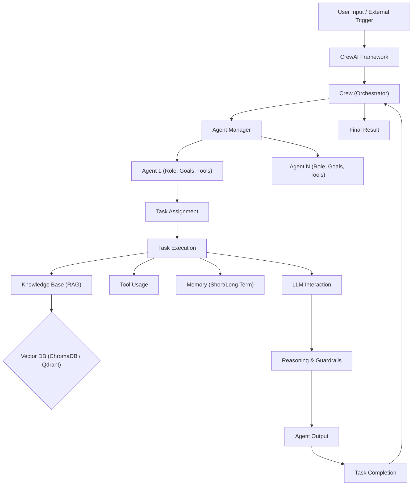

# 🚀 CrewAI: Orchestrating Intelligent Autonomous Agents

<p align="center"></p>

Unleash the full potential of collaborative AI with CrewAI – a cutting-edge framework designed to effortlessly orchestrate intelligent autonomous agents. Go beyond single-agent interactions and empower your applications with multi-agent systems that work together, leveraging specialized roles, shared knowledge, and dynamic workflows to tackle complex problems with unparalleled efficiency and precision.

CrewAI transforms your vision of autonomous AI into reality, enabling seamless collaboration, robust decision-making, and superior output for any challenge.

## Short Description

CrewAI is a powerful, extensible framework for building and managing multi-agent AI systems. It provides the foundational components to define agents with distinct roles, goals, and backstories, assign them complex tasks, and orchestrate their collaboration through flexible processes. With built-in support for various LLMs, advanced memory management, Retrieval Augmented Generation (RAG), tool integration, and observability, CrewAI empowers developers to create sophisticated, intelligent workflows that adapt and learn.

## ✨ Key Features

*   **Intelligent Agent Orchestration:** Define and manage teams of AI agents with specialized roles, goals, and personalized backstories for highly effective collaboration.
*   **Dynamic Workflow Management:** Implement flexible, adaptable processes (sequential or hierarchical) that allow agents to delegate tasks, ask clarifying questions, and dynamically adjust their approach.
*   **Seamless Tool Integration:** Equip agents with a rich array of tools, from general utilities to specialized functions, enabling them to interact with the real world and perform complex actions.
*   **Advanced Memory System:** Leverage diverse memory types including short-term (contextual), long-term, and entity memory, allowing agents to retain and recall information relevant to their tasks and crew interactions.
*   **Retrieval Augmented Generation (RAG):** Integrate knowledge bases using ChromaDB or Qdrant to provide agents with relevant, up-to-date information, significantly reducing hallucinations and improving response accuracy.
*   **LLM Agnostic Design:** Connect to any Large Language Model, offering unparalleled flexibility to choose the best model for your specific needs, whether it's OpenAI, Hugging Face, or custom models.
*   **Robust Observability & Debugging:** Gain deep insights into agent reasoning, tool usage, and task execution with comprehensive logging and event tracing capabilities.
*   **Human-in-the-Loop (HITL) Support:** Integrate human oversight and intervention points within agent workflows for validation, decision-making, or guidance.
*   **Command Line Interface (CLI):** Quickly scaffold, manage, and deploy your agent crews with intuitive CLI commands.

## Who is this for?

CrewAI is meticulously crafted for:

*   **AI Engineers & Developers:** Building sophisticated, multi-agent AI applications.
*   **Researchers:** Experimenting with agent-based AI systems and collective intelligence.
*   **Data Scientists:** Automating complex analytical workflows and decision-making processes.
*   **Solution Architects:** Designing robust and scalable AI solutions for enterprise needs.
*   **Anyone** looking to move beyond simple LLM prompts and build truly autonomous, collaborative AI systems.

## Technology Stack & Architecture

CrewAI is built predominantly in **Python**, leveraging its rich ecosystem for AI development. Key architectural components and technologies include:

*   **Core Language:** Python
*   **Large Language Models (LLMs):** Pluggable architecture supporting various providers (e.g., OpenAI, custom LLMs).
*   **Vector Databases:** ChromaDB, Qdrant for efficient RAG capabilities.
*   **Persistence:** SQLite for local storage and state management of flows.
*   **Event-Driven Architecture:** A custom event bus manages inter-agent communication and system-wide events, enabling advanced observability.
*   **CLI:** Built with modern Python CLI tools for ease of use.

## 📊 Architecture & Database Schema

CrewAI empowers a dynamic interaction flow, where specialized agents collaborate to execute tasks. The high-level architecture can be visualized as follows:



## ⚡ Quick Start Guide

To get started with CrewAI, follow these simple steps:

1.  **Install CrewAI:**
    ```bash
    pip install crewai
    ```

2.  **Define your Agents, Tasks, and Crew:**
    Create a Python file (e.g., `my_crew.py`) and define your components:

    ```python
    from crewai import Agent, Task, Crew, Process

    # Define your agents
    researcher = Agent(
        role='Senior Research Analyst',
        goal='Uncover groundbreaking insights on {topic}',
        backstory='A meticulous researcher with a knack for deep dives.',
        verbose=True,
        allow_delegation=False
    )

    writer = Agent(
        role='Content Creator',
        goal='Craft compelling articles on {topic}',
        backstory='A creative wordsmith, adept at engaging narratives.',
        verbose=True,
        allow_delegation=False
    )

    # Define your tasks
    task1 = Task(
        description='Identify the top 5 emerging trends in AI for the past year related to {topic}.',
        agent=researcher
    )

    task2 = Task(
        description='Write a blog post summarizing these 5 trends, highlighting their impact.',
        agent=writer,
        context=[task1]
    )

    # Instantiate your crew
    my_crew = Crew(
        agents=[researcher, writer],
        tasks=[task1, task2],
        process=Process.sequential, # Or Process.hierarchical
        verbose=2 # Outputs more detailed logs
    )

    # Kickoff the crew's work
    result = my_crew.kickoff(inputs={'topic': 'Large Language Models'})
    print(result)
    ```

3.  **Run your Crew:**
    ```bash
    python my_crew.py
    ```
    Watch as your agents collaborate to achieve the defined goals!

## 📜 License

This project is licensed under the **MIT License**. See the [LICENSE](LICENSE) file for more details.