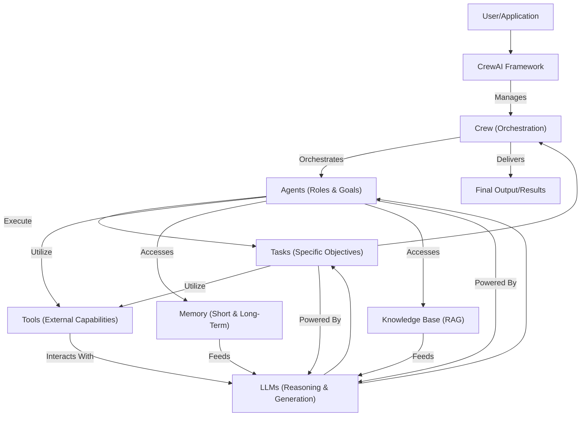

# 🚀 crewAI: Build and Orchestrate Autonomous AI Agents

<p align="center"></p>

## Short Description
`crewAI` is a cutting-edge open-source framework designed for orchestrating role-playing autonomous AI agents. It enables developers to define and deploy crews of intelligent agents that collaborate to solve complex problems, mimicking human team dynamics. From dynamic task management and shared memory to integrating specialized tools and knowledge bases, `crewAI` empowers you to build sophisticated AI applications with unparalleled flexibility and control.

## ✨ Key Features
*   **Multi-Agent Collaboration:** Design agents with distinct roles, goals, and backstories, fostering rich, collaborative problem-solving.
*   **Flexible Process Orchestration:** Support for both **Sequential** and **Hierarchical** task execution, allowing for intricate workflows.
*   **Dynamic Task Management:** Agents can dynamically assign, delegate, and execute tasks, including conditional logic for adaptive workflows.
*   **Advanced Memory System:** Implement short-term, long-term, and contextual memory to ensure agents learn, adapt, and retain crucial information.
*   **Knowledge Integration (RAG):** Seamlessly connect agents to external knowledge bases and vector databases (ChromaDB, Qdrant) for Retrieval Augmented Generation, ensuring informed decision-making.
*   **Extensible Tool Integration:** Equip agents with a vast array of tools for web scraping, data access, code execution, image generation (DALL-E), and more. Easily add custom tools to extend capabilities.
*   **Customizable LLM Support:** Integrate with various Large Language Models, allowing you to choose the best model for each agent's specific needs.
*   **Event-Driven Architecture:** Monitor agent interactions and task progressions with a robust event listener system, providing deep insights into execution.
*   **Evaluation & Observability:** Tools for evaluating agent performance and integrating with observability platforms (Langfuse, MLflow) to fine-tune your crews.
*   **CLI & Deployment:** A powerful Command Line Interface for quick setup, deployment, and management of your multi-agent systems.

## Who is this for?
`crewAI` is ideal for:
*   **AI Developers & Engineers:** Building complex, intelligent applications requiring agent collaboration.
*   **Researchers:** Experimenting with multi-agent systems, collective intelligence, and emergent behaviors.
*   **Data Scientists:** Automating research, analysis, and data-driven decision-making processes.
*   **Product Teams:** Crafting innovative AI products with advanced reasoning and task execution capabilities.
*   **Anyone** looking to leverage the full potential of AI agents beyond single-prompt interactions.

## Technology Stack & Architecture
`crewAI` is built primarily with **Python**, leveraging the following key components:

*   **Core:** Python 3.9+
*   **LLMs:** Integrates with various Large Language Models (OpenAI, Hugging Face, custom LLMs) via `src/crewai/llm.py` and `src/crewai/llms`.
*   **Pydantic:** Used extensively for data validation and settings management (e.g., in `src/crewai/utilities/pydantic_schema_parser.py`).
*   **Vector Databases:** Supports ChromaDB (`src/crewai/rag/chromadb`) and Qdrant (`src/crewai/rag/qdrant`) for RAG functionalities.
*   **Memory Storage:** Utilizes SQLite (`src/crewai/memory/storage/ltm_sqlite_storage.py`) for long-term memory.
*   **Tooling:** An extensible framework for integrating diverse tools for various tasks, categorized in `docs/en/tools` (AI/ML, Automation, Cloud Storage, Database, File/Document, Search/Research, Web Scraping).
*   **CLI:** Built with `click` (implied by `src/crewai/cli/cli.py`) for command-line interactions.

## 📊 Architecture & Database Schema
The `crewAI` framework orchestrates intelligent agents, tasks, and tools to achieve complex goals. At its core, a **Crew** manages **Agents**, each with specific **Roles** and **Goals**. These Agents perform **Tasks** using available **Tools**, with their interactions and learning facilitated by an advanced **Memory** system and external **Knowledge Bases**.



**Database Schema (Inferred from File Structure):**
`crewAI`'s flexible architecture allows for various data persistence strategies.
*   **Memory Storage:**
    *   **Long-Term Memory:** Implemented using SQLite (`ltm_sqlite_storage.py`), likely storing episodic memories, learned behaviors, and key facts.
    *   **Contextual/Short-Term Memory:** Managed in-memory or through specialized handlers for immediate task context.
*   **Knowledge Bases (RAG):** Integrates with external vector databases like ChromaDB and Qdrant, which manage and store embeddings for document retrieval. While not directly part of the `crewAI` internal database, they are critical for information access.
*   **Flow Persistence:** State of execution flows can be persisted, enabling resumability (`flow/persistence/sqlite.py`).

## ⚡ Quick Start Guide
To get started with `crewAI`, follow these simple steps:

1.  **Installation:**
    ```bash
    pip install crewai
    ```

2.  **Set up your Environment Variables:**
    Configure your LLM API keys (e.g., OpenAI API key) in a `.env` file or directly in your script.
    ```bash
    export OPENAI_API_KEY='YOUR_OPENAI_API_KEY'
    ```

3.  **Create your first Crew:**
    Define your agents, tasks, and the crew that orchestrates them in a Python script.
    ```python
    from crewai import Agent, Task, Crew, Process
    from crewai_tools import SerperDevTool

    # Define your tools
    search_tool = SerperDevTool()

    # Define your agents
    researcher = Agent(
        role='Senior Researcher',
        goal='Uncover groundbreaking technologies in AI',
        backstory='A seasoned researcher with a knack for identifying revolutionary tech.',
        tools=[search_tool],
        verbose=True,
        allow_delegation=False
    )

    writer = Agent(
        role='Tech Content Writer',
        goal='Produce engaging and informative articles on AI advancements',
        backstory='A skilled writer capable of translating complex tech into compelling narratives.',
        verbose=True,
        allow_delegation=True
    )

    # Define your tasks
    task1 = Task(
        description='Identify the top 3 emerging AI technologies in 2024.',
        expected_output='A ranked list of the top 3 emerging AI technologies, with a brief explanation for each.',
        agent=researcher
    )

    task2 = Task(
        description='Write a compelling blog post about the highest-ranked technology from Task 1.',
        expected_output='A 500-word blog post, optimized for engagement.',
        agent=writer
    )

    # Instantiate your crew
    tech_crew = Crew(
        agents=[researcher, writer],
        tasks=[task1, task2],
        process=Process.sequential, # or Process.hierarchical
        verbose=2 # You can set it to 1 or 2 for different levels of verbosity
    )

    # Kickoff the crew
    print("🚀 CrewAI is starting up...")
    result = tech_crew.kickoff()
    print("\n\n########################")
    print("## Here is the Final Result")
    print("########################\n")
    print(result)
    ```

This example demonstrates a simple sequential process where a `researcher` identifies technologies and a `writer` then drafts a blog post.

## 📜 License
`crewAI` is distributed under the **MIT License**. See the `LICENSE` file for more details.
