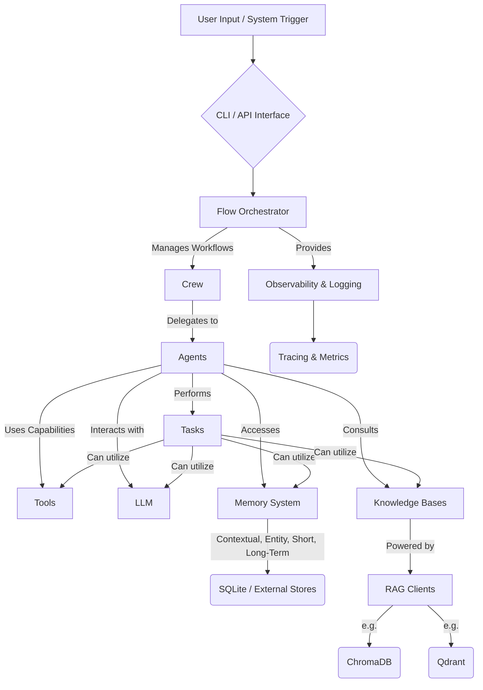

# 🚀 CrewAI: Orchestrating Autonomous AI Agents for Unrivaled Collaboration

<p align="center"></p>

## Short Description
CrewAI is a revolutionary open-source framework designed for orchestrating role-playing, autonomous AI agents. It empowers developers to build, manage, and scale intelligent agent systems that collaborate seamlessly, leveraging specialized skills, shared goals, and powerful tools to tackle complex tasks. With CrewAI, you're not just building AI; you're building a highly efficient, collaborative AI ecosystem.

## ✨ Key Features
*   **Multi-Agent Orchestration:** Define and manage a "crew" of specialized AI agents, each with distinct roles, goals, and backstories, fostering advanced teamwork.
*   **Flexible Task Management:** Assign granular tasks with clear objectives, enabling agents to execute responsibilities effectively within a structured workflow.
*   **Dynamic Workflow Execution:** Implement sophisticated processes, from sequential hand-offs to complex hierarchical structures, adapting to the task's demands.
*   **Advanced Memory Systems:** Equip agents with diverse memory capabilities including short-term, long-term, contextual, and external memory, allowing for cumulative learning and informed decision-making.
*   **Seamless Tool Integration:** Integrate a vast array of custom and predefined tools (e.g., web search, file operations, database queries, automation, AI/ML tools, multimodal capabilities) to extend agents' capabilities.
*   **Retrieval Augmented Generation (RAG):** Connect agents to external knowledge bases and vector stores (like ChromaDB and Qdrant) for up-to-date, accurate, and contextually relevant information retrieval.
*   **Customizable LLM Support:** Leverage any Large Language Model, from OpenAI's GPT series to open-source models like Llama3 via Ollama, ensuring flexibility and cutting-edge performance.
*   **Comprehensive Observability:** Monitor agent activities, task execution, and system performance through various integrations, ensuring transparency and debuggability.
*   **Robust CLI & Enterprise Features:** Streamline development, deployment, and management with a powerful Command-Line Interface, complemented by enterprise-grade features for security, team management, and integrations.

## Who is this for?
CrewAI is built for **AI developers, solution architects, data scientists, researchers, and engineering teams** who are:
*   Building sophisticated, autonomous AI applications.
*   Automating complex workflows that require collaborative intelligence.
*   Developing next-generation AI products and services.
*   Seeking to integrate advanced AI capabilities into existing enterprise systems.
*   Experimenting with multi-agent systems and agentic AI.

If you envision a world where AI agents don't just react but proactively collaborate to achieve ambitious goals, CrewAI is your foundation.

## Technology Stack & Architecture
CrewAI is built predominantly in **Python**, leveraging its rich ecosystem for AI and machine learning.

*   **Core:** Python 3.x
*   **AI Framework:** Custom multi-agent orchestration logic, task management, and communication protocols.
*   **LLMs:** Integrates with various LLM providers (e.g., OpenAI, Anthropic, Google Gemini, Ollama for local models) allowing for flexible model selection.
*   **Memory:** Utilizes SQLite for internal memory persistence and supports integration with external memory solutions.
*   **RAG (Retrieval Augmented Generation):** Integrates with vector databases such as ChromaDB and Qdrant for external knowledge management.
*   **Tooling:** Supports diverse tools for interaction with external APIs, file systems, databases, web scraping (e.g., Apify, Multion, Firecrawl, Selenium), and specific AI/ML functionalities (e.g., DALL-E, Code Interpreter).
*   **CLI:** Built with a robust Command-Line Interface for project scaffolding, development, testing, and deployment.
*   **Observability:** Integrations with popular platforms like Langfuse, MLflow, OpenLit, Portkey, Weave, and more for comprehensive monitoring and tracing.
*   **Project Structure:** Modular design with clear separation of concerns for agents, tasks, crews, flows, memory, and tools.

## 📊 Architecture & Database Schema

CrewAI's architecture is designed for modularity and scalability, enabling complex interactions between specialized AI components.



## ⚡ Quick Start Guide

Get your first CrewAI project up and running in no time!

1.  **Install CrewAI:**
    ```bash
    pip install crewai
    ```

2.  **Create Your First Crew Project:**
    Use the CLI to scaffold a new project:
    ```bash
    crewai create crew my_marketing_crew
    cd my_marketing_crew
    ```

3.  **Define Your Agents and Tasks:**
    Edit the generated `crew.py`, `config/agents.yaml`, and `config/tasks.yaml` files to define your crew's roles, goals, and the tasks they'll perform.

    A minimal `crew.py` example:
    ```python
    from crewai import Agent, Task, Crew, Process

    # Define your agents with roles and goals
    researcher = Agent(
        role='Senior Research Analyst',
        goal='Uncover groundbreaking insights on {topic}',
        backstory='A seasoned analyst with a knack for deep research...',
        verbose=True,
        allow_delegation=False
    )
    writer = Agent(
        role='Content Strategist',
        goal='Craft compelling content on {topic}',
        backstory='Known for elegant and persuasive writing...',
        verbose=True,
        allow_delegation=False
    )

    # Define your tasks
    task1 = Task(
        description='Investigate the latest trends in {topic}.',
        agent=researcher
    )
    task2 = Task(
        description='Write a detailed report based on the research findings.',
        agent=writer,
        context=[task1]
    )

    # Instantiate your crew
    crew = Crew(
        agents=[researcher, writer],
        tasks=[task1, task2],
        process=Process.sequential,
        verbose=2
    )

    # Kickoff the crew to start the process
    result = crew.kickoff(inputs={'topic': 'Artificial Intelligence in Healthcare'})
    print(result)
    ```

4.  **Run Your Crew:**
    Execute your crew from the command line:
    ```bash
    python main.py
    ```
    (Or directly run your script if you defined the crew setup within it.)

For more detailed guides and advanced configurations, please refer to the official [CrewAI Documentation](https://www.crewai.com/docs).

## 📜 License
This project is licensed under the [MIT License](LICENSE).