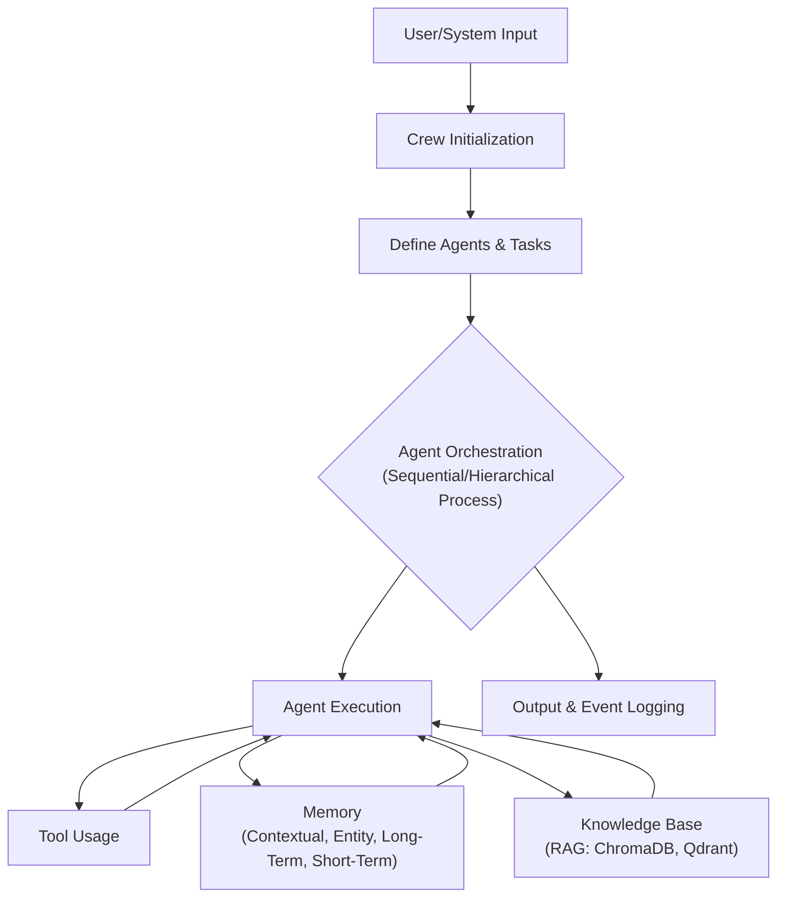

# 🚀 CrewAI: Orchestrating Autonomous AI Agents

<p align="center"></p>

## Short Description
CrewAI is an advanced, open-source framework designed to empower developers and AI engineers to build, manage, and scale intelligent, collaborative AI agent systems. It transforms complex, multi-step tasks into streamlined, autonomous workflows by enabling agents to communicate, delegate, and leverage a rich ecosystem of tools and knowledge bases.

## ✨ Key Features
*   **Intelligent Agent Orchestration:** Define roles, goals, and backstories for a "crew" of AI agents to achieve complex objectives through collaborative workflows (sequential or hierarchical processes).
*   **Dynamic Task Management:** Assign tasks with specific inputs, expected outputs, and even human-in-the-loop interventions, ensuring adaptable execution.
*   **Extensive Tool Integration:** Equip agents with a vast array of tools for AI/ML operations, automation, cloud storage interaction, database querying, file manipulation, advanced search & research, and powerful web scraping.
*   **Sophisticated Memory Systems:** Leverage diverse memory types—contextual, entity, long-term, and short-term—to provide agents with persistent and relevant information for enhanced decision-making.
*   **Retrieval Augmented Generation (RAG):** Seamlessly integrate with internal and external knowledge bases (ChromaDB, Qdrant) to ground agents' responses and actions in factual data.
*   **Flow Visualization:** Gain clarity and control over complex agent interactions with generated visual representations of your crew's operational flow.
*   **CLI for Rapid Development:** Quickly scaffold new agent projects, flows, and tools with an intuitive command-line interface.
*   **Robust Observability & Evaluation:** Monitor agent performance, trace execution paths, and evaluate outcomes to refine and optimize your AI crews.
*   **Flexible LLM Compatibility:** Connect with your preferred Large Language Models, including advanced integrations for OpenAI, LangGraph, and more.

## Who is this for?
CrewAI is built for **developers, AI engineers, data scientists, and enterprises** eager to push the boundaries of AI automation. If you're looking to:
*   Automate complex business processes.
*   Conduct advanced research and data analysis.
*   Develop intelligent assistants and support systems.
*   Explore multi-agent systems and their collaborative capabilities.
*   Build scalable and observable AI applications.

... then CrewAI provides the foundational framework you need.

## Technology Stack & Architecture
CrewAI is primarily built with **Python**, leveraging its robust ecosystem for AI development. It integrates with various Large Language Models (LLMs) and tools, offering flexibility in deployment.
Key components include:
*   **Core Framework:** Python
*   **LLM Integrations:** OpenAI, custom LLMs, Ollama, Google Gemini.
*   **Vector Databases:** ChromaDB, Qdrant (for RAG capabilities).
*   **Workflow Engine:** Custom orchestration logic (sequential, hierarchical).
*   **CLI:** For project generation and management.
*   **Persistence:** SQLite (for memory management and flow states).

## 📊 Architecture & Database Schema



## ⚡ Quick Start Guide

To get started with CrewAI, follow these simple steps:

1.  **Installation:**
    ```bash
    pip install crewai
    ```

2.  **Create a New Crew Project:**
    ```bash
    crewai create crew my_marketing_crew
    cd my_marketing_crew
    ```
    This command scaffolds a new project with example agents and tasks.

3.  **Run Your Crew:**
    ```bash
    python main.py
    ```
    Watch your agents collaborate and solve problems!

## 📜 License
This project is licensed under the terms found in the [LICENSE](LICENSE) file.
