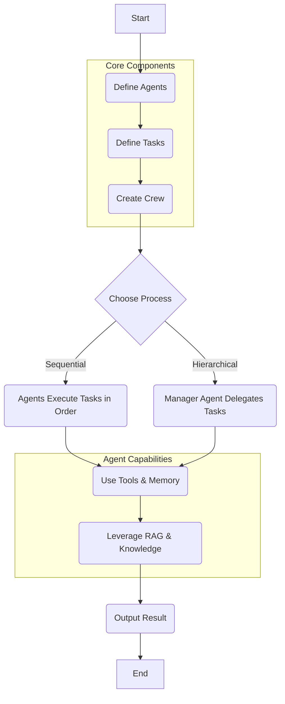

# 🚀 crewAI

<p align="center"></p>

## Short Description
`crewAI` is a cutting-edge framework designed for orchestrating intelligent AI agents into collaborative crews. It empowers developers to define, assign, and manage autonomous agents with distinct roles, goals, and backstories, enabling them to work together seamlessly to tackle complex problems and automate intricate workflows. Go beyond single-agent interactions and build robust, cooperative AI teams.

## ✨ Key Features

*   **Intelligent Agent Orchestration**: Define sophisticated AI agents, each with unique roles, goals, backstories, and specific tools, optimizing their individual contributions.
*   **Collaborative AI Crews**: Enable seamless, goal-oriented communication and dynamic task delegation among agents, mimicking efficient human team dynamics.
*   **Flexible Process Management**: Support for various process flows including sequential, hierarchical, and custom architectures, allowing adaptation to any workflow complexity.
*   **Rich Tool Integration**: Empower agents with an extensive range of tools for web searching, data processing, code execution, image generation, and interaction with enterprise systems.
*   **Memory & Knowledge Management**: Implement diverse memory types (short-term, long-term, contextual, and entity memory) alongside Retrieval-Augmented Generation (RAG) capabilities for enriched knowledge retrieval.
*   **Observability & Tracing**: Gain deep operational insights into agent reasoning, tool usage, and overall crew execution with integrations for leading observability platforms.
*   **Customizable LLM Integration**: Utilize any LLM provider, from popular services like OpenAI and Google Gemini to local models, with robust API and configuration options.
*   **Developer-Friendly CLI**: Rapidly scaffold, deploy, and manage crews and flows with an intuitive command-line interface.
*   **Enterprise-Ready Features**: Includes advanced capabilities such as hallucination guardrails, role-based access control (RBAC), webhook streaming, and agent/tool repositories to meet enterprise demands.

## Who is this for?
`crewAI` is ideal for:
*   **AI Developers & Engineers**: Building complex, multi-agent AI applications that require sophisticated orchestration.
*   **Data Scientists & Researchers**: Experimenting with collaborative AI paradigms and advancing agentic workflows.
*   **Business & Automation Specialists**: Automating intricate, multi-step business processes with reliable and intelligent AI teams.
*   **MLOps Professionals**: Implementing scalable, observable, and enterprise-grade multi-agent solutions.
*   **Innovators**: Anyone looking to push the boundaries of what's possible with large language models by creating dynamic and intelligent AI systems.

## Technology Stack & Architecture

*   **Core Language**: Python
*   **LLM Integration**: Supports popular LLMs (e.g., OpenAI, Google Gemini) and enables custom LLM implementations.
*   **Vector Databases & RAG**: Integration with ChromaDB and Qdrant for efficient knowledge retrieval and RAG capabilities.
*   **Observability**: Integrates with cutting-edge platforms like Langfuse, MLflow, Arize Phoenix, LangDB, Langtrace, Maxim, Neatlogs, OpenLit, OPIK, Patronus, Portkey, Truefoundry, and Weave.
*   **Tooling Ecosystem**: Designed for extensibility, supporting a wide variety of external and internal tools for agents to interact with their environment.
*   **CLI**: Built with a robust Python CLI framework for easy project management and deployment.
*   **Dependency Management**: Utilizes `poetry` for efficient dependency management and `uv` for fast package resolution.

## 📊 Architecture & Database Schema

The core of `crewAI` revolves around the dynamic interaction and orchestration of Agents and Tasks within a Crew, guided by defined processes and leveraging external knowledge and tools.



## ⚡ Quick Start Guide

To get your first intelligent crew up and running with `crewAI`, follow these simple steps:

1.  **Install `crewAI`**:
    ```bash
    pip install crewai
    ```

2.  **Set up your environment variables**:
    Export your LLM API key (e.g., OpenAI API key):
    ```bash
    export OPENAI_API_KEY='YOUR_API_KEY'
    ```

3.  **Create your first crew**:
    Define your agents and tasks, then assemble them into a crew.

    ```python
    from crewai import Agent, Task, Crew, Process
    from langchain_openai import ChatOpenAI

    # Instantiate your LLM
    llm = ChatOpenAI(model="gpt-4o", temperature=0.7)

    # Define your agents
    researcher = Agent(
        role='Senior Research Analyst',
        goal='Uncover groundbreaking insights from various data sources',
        backstory='A seasoned analyst with a knack for distilling complex information into actionable insights.',
        verbose=True,
        allow_delegation=False,
        llm=llm
    )

    writer = Agent(
        role='Professional Content Writer',
        goal='Craft compelling narratives based on research findings',
        backstory='A master of storytelling, transforming raw data into engaging articles.',
        verbose=True,
        allow_delegation=False,
        llm=llm
    )

    # Define your tasks
    task1 = Task(
        description='Investigate the latest AI advancements in 2024.',
        expected_output='A concise report on key AI trends and breakthroughs.',
        agent=researcher
    )

    task2 = Task(
        description='Write a blog post about the findings from the research report.',
        expected_output='An engaging blog post, 500 words minimum, tailored for a tech audience.',
        agent=writer,
        context=[task1]
    )

    # Instantiate your crew
    tech_crew = Crew(
        agents=[researcher, writer],
        tasks=[task1, task2],
        process=Process.sequential,
        verbose=2
    )

    # Kickoff the crew!
    result = tech_crew.kickoff()
    print("\n\n########################")
    print("## Here is the Final Result")
    print("########################\n")
    print(result)
    ```

## 📜 License

This project is licensed under the terms of the **MIT License**. For more details, see the [LICENSE](LICENSE) file.

