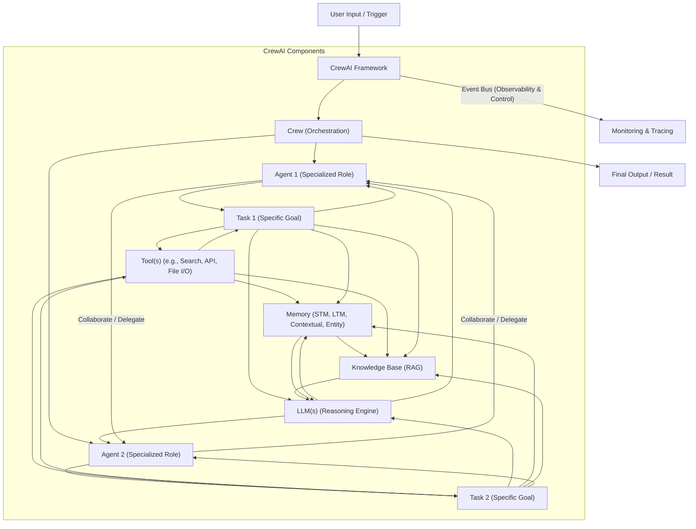

# 🚀 crewAI

<p align="center"></p>

<p align="center">
    <a href="https://github.com/grewal16/crewAI/stargazers"></a>
    <a href="https://github.com/grewal16/crewAI/network/members"></a>
    <a href="https://github.com/grewal16/crewAI/issues"></a>
    <a href="./LICENSE"></a>
</p>

## Short Description
An advanced open-source framework meticulously crafted for orchestrating autonomous AI agents through sophisticated, collaborative, and sequential workflows. Empower your applications with intelligent agents that can reason, plan, and execute complex tasks, featuring seamless communication, adaptable tooling, and shared goals.

## 🛡️ Project Health & Status
`crewAI` stands as a testament to robust, active development. Backed by extensive test suites and a comprehensive Continuous Integration (CI) pipeline (including `linter.yml`, `security-checker.yml`, `type-checker.yml`, and `tests.yml` workflows), it guarantees exceptional code quality, stability, and reliability. This project is not just actively maintained; it's engineered for production-readiness, ensuring a secure, performant, and highly maintainable codebase.

## ✨ Key Features
*   **Multi-Agent Orchestration:** Design and manage intelligent crews of AI agents that collaborate and delegate tasks to achieve complex objectives.
*   **Flexible Task Management:** Assign agents to specific tasks, allowing for both sequential and hierarchical execution flows tailored to your needs.
*   **Pluggable Tool Integration:** Equip your agents with a vast array of tools for diverse operations, including web scraping, data access, code interpretation, image generation, and seamless third-party integrations.
*   **Advanced Memory System:** Agents benefit from comprehensive Short-Term, Long-Term, Contextual, and Entity Memory, fostering enhanced coherence, statefulness, and learning capabilities.
*   **Retrieval Augmented Generation (RAG):** Integrate powerful knowledge bases (such as ChromaDB and Qdrant) to arm agents with relevant, up-to-date information, leading to superior reasoning and more accurate outputs.
*   **LLM Agnostic:** Enjoy the freedom to work with your preferred Large Language Models, including OpenAI, Anthropic, Google Gemini, Ollama, and a robust architecture for integrating custom LLMs.
*   **CLI for Project Management:** Accelerate your development with a powerful Command Line Interface, enabling rapid creation, management, and deployment of your agentic workflows.
*   **Observability & Tracing:** Gain unparalleled insight into agent behavior and task execution through built-in tracing and event listeners, making debugging and optimization effortless.
*   **Guardrails:** Implement intelligent hallucination and LLM guardrails to ensure more reliable, safe, and trustworthy outputs from your autonomous systems.
*   **Human-in-the-Loop:** Seamlessly incorporate human feedback and intervention at crucial stages of the workflow, combining AI efficiency with human oversight.

## Who is this for?
`crewAI` is the go-to framework for **Software Engineers**, **AI Developers**, **Machine Learning Engineers**, and **Researchers** aiming to build, deploy, and scale sophisticated autonomous AI systems. If your goal is to automate multi-step processes, enhance decision-making through advanced AI collaboration, or create groundbreaking agentic applications that push the boundaries of AI, `crewAI` provides the robust structure and powerful tools to transform your vision into reality.

## Technology Stack & Architecture
`crewAI` is meticulously crafted primarily using **Python**, leveraging `poetry` for efficient dependency management and robust packaging. Its architecture emphasizes modularity and extensibility, facilitating seamless integration with a diverse ecosystem of AI technologies.

*   **Core Language:** Python
*   **Package Management:** Poetry (utilized via `pyproject.toml` and `uv.lock`)
*   **Large Language Models (LLMs):** Designed for compatibility with various LLM providers, including OpenAI, Anthropic, Google Gemini, and Ollama, with robust support for custom LLM integrations.
*   **Vector Databases:** Seamless integration with vector stores like ChromaDB and Qdrant, forming the backbone of its Retrieval Augmented Generation (RAG) capabilities.
*   **Workflow Orchestration:** Extends agentic capabilities by integrating with `LangChain` components and leveraging `LangGraph` for advanced, stateful agent graphs.
*   **Command Line Interface (CLI):** Features a comprehensive CLI for streamlined project creation, management, and deployment.
*   **Testing Framework:** Utilizes Pytest for rigorous testing, ensuring high reliability and code integrity.

## 📊 Architecture & Database Schema
The `crewAI` framework is engineered with a modular, extensible architecture that empowers the creation of highly intelligent and collaborative agentic systems. At its heart, a **Crew** acts as an orchestrator, directing multiple specialized **Agents**. Each Agent is assigned specific **Tasks**, which they execute by leveraging advanced **LLMs** for complex reasoning and a rich set of **Tools** to interact with the environment. These interactions are enhanced by a sophisticated **Memory System** (including Short-Term, Long-Term, Contextual, and Entity Memory) and augmented by **Knowledge Bases** (RAG), providing agents with crucial context. The entire workflow, from user input to final output, is tracked through an integrated event bus, facilitating observability and control.


```mermaid
graph TD
    A["User Input / Trigger"] --> B["CrewAI Framework"];

    subgraph CrewAI Components
        B --> C["Crew (Orchestration)"];
        C --> D["Agent 1 (Specialized Role)"];
        C --> E["Agent 2 (Specialized Role)"];
        D --> F["Task 1 (Specific Goal)"];
        E --> G["Task 2 (Specific Goal)"];
        F --> H["Tool(s) (e.g., Search, API, File I/O)"];
        G --> H;
        F --> I["LLM(s) (Reasoning Engine)"];
        G --> I;
        I --> J["Memory (STM, LTM, Contextual, Entity)"];
        H --> J;
        J --> K["Knowledge Base (RAG)"];
        H --> K;
        F --> J;
        G --> J;
        F --> K;
        G --> K;
    end

    K --> I;
    J --> I;
    H --> F;
    H --> G;
    I --> D;
    I --> E;
    F --> D;
    G --> E;
    D -- "Collaborate / Delegate" --> E;
    E -- "Collaborate / Delegate" --> D;
    C --> L["Final Output / Result"];
    B -- "Event Bus (Observability & Control)" --> M["Monitoring & Tracing"];
```

## ⚙️ Configuration & Deployment
Configuring and deploying `crewAI` projects involves a straightforward process, enabling you to bring your autonomous agents to life:
1.  **Python Environment Setup:** Ensure you have a Python environment ready. Using `poetry` is recommended for managing project dependencies and virtual environments.
2.  **Install Dependencies:** Install `crewAI` and any required tools/LLM integrations using your preferred package manager:
    ```bash
    pip install crewai
    # Or, if using poetry:
    # poetry add crewai
    ```
3.  **API Key Configuration:** Securely set your LLM API keys and any external tool credentials as environment variables (e.g., in a `.env` file). `crewAI` provides CLI utilities (`crewai auth`) to assist with authentication for integrated enterprise services.
4.  **CLI Deployment (Optional):** For seamless deployment of your agentic workflows, leverage the `crewai deploy` command. This command is designed to package and deploy your crew to compatible platforms, as supported by the `crewAI` ecosystem.

## ⚡ Quick Start Guide
Get your first `crewAI` project up and running in minutes!

1.  **Install `crewAI`:**
    Open your terminal and install the `crewai` package:
    ```bash
    pip install crewai crewai_tools
    # Or, if using poetry:
    # poetry add crewai crewai_tools
    ```

2.  **Set up Environment Variables:**
    Create a `.env` file in your project root and add your LLM API key (e.g., for OpenAI, set `OPENAI_API_KEY=YOUR_API_KEY_HERE`).

3.  **Define Your Crew (e.g., `main.py`):**
    Craft a Python script to define your agents, their roles, goals, tasks, and how they collaborate.
    ```python
    from crewai import Agent, Task, Crew, Process
    from crewai_tools import SerperDevTool # Example tool

    # Initialize a tool for web searching
    search_tool = SerperDevTool()

    # Define your agents
    researcher = Agent(
        role='Senior Research Analyst',
        goal='Uncover groundbreaking technologies in AI',
        backstory='A seasoned analyst with a keen eye for disruptive innovations and a passion for data.',
        verbose=True,
        allow_delegation=False,
        tools=[search_tool]
    )

    writer = Agent(
        role='Tech Content Strategist',
        goal='Craft compelling and engaging content about AI advancements',
        backstory='A visionary writer who transforms complex technological concepts into captivating stories.',
        verbose=True,
        allow_delegation=True
    )

    # Define your tasks
    research_task = Task(
        description='Identify the top 3 most impactful AI technologies introduced in the last 6 months.',
        expected_output='A detailed report outlining each technology, its potential applications, and estimated market impact.',
        agent=researcher
    )

    write_report_task = Task(
        description='Based on the research report, write an engaging 4-paragraph blog post about the findings.',
        expected_output='A well-structured blog post, formatted in markdown, suitable for a tech news website.',
        agent=writer,
        context=[research_task] # The writer uses the output of the research task as context
    )

    # Instantiate your crew
    tech_crew = Crew(
        agents=[researcher, writer],
        tasks=[research_task, write_report_task],
        process=Process.sequential,  # Agents execute tasks one after another
        verbose=2, # Set to 1 for basic logging, 2 for detailed agent action log
    )

    # Kickoff the crew
    print("🚀 Initiating the AI Tech News Crew...")
    result = tech_crew.kickoff(inputs={'topic': 'latest AI breakthroughs in sustainable energy'})

    print("\n\n########################")
    print("## Final Output from the Crew")
    print("########################\n")
    print(result)
    ```

4.  **Run Your Crew:**
    Execute your Python script from the terminal:
    ```bash
    python main.py
    ```
    Observe your agents in action, collaborating and executing tasks to deliver the final output!

## 📜 License
This project is open-source and distributed under the **MIT License**. For more details, please refer to the [LICENSE](LICENSE) file in the repository.