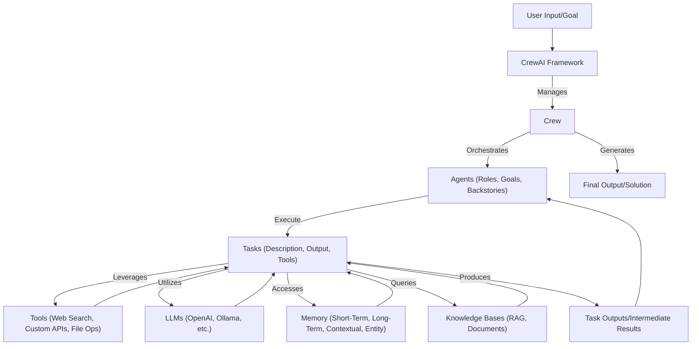

# 🚀 crewAI: Multi-Agent Framework for Orchestrated AI Workflows

<p align="center"></p>

<p align="center">
  <a href="https://github.com/grewal16/crewAI/stargazers"></a>
  <a href="https://github.com/grewal16/crewAI/network/members"></a>
  <a href="https://github.com/grewal16/crewAI/issues"></a>
  <a href="./LICENSE"></a>
</p>

## Short Description
crewAI is an innovative framework designed to orchestrate autonomous AI agents, enabling them to collaborate seamlessly to achieve complex goals. By defining roles, tasks, and processes, developers can build intelligent "crews" that leverage advanced reasoning, dynamic tool usage, and sophisticated memory management to tackle real-world problems with unparalleled efficiency and accuracy.

## ✨ Key Features
*   **Intelligent Agent Orchestration:** Define and deploy multiple AI agents with distinct roles, goals, and backstories for dynamic collaboration.
*   **Flexible Task Management:** Assign granular tasks to agents, enabling complex workflows through sequential, hierarchical, and custom processes.
*   **Advanced Memory System:** Equip agents with short-term, long-term, contextual, and entity memory for persistent learning and informed decision-making.
*   **Robust Tool Integration:** Empower agents with an extensive suite of tools, from web scraping and data analysis to custom actions, expanding their capabilities.
*   **LLM Agnostic:** Seamlessly integrate with various Large Language Models, including OpenAI, Anthropic, Hugging Face, and local models via Ollama.
*   **Observability & Evaluation:** Gain deep insights into agent behavior, task execution, and crew performance through tracing, event listeners, and an experimental evaluation framework.
*   **Enterprise Readiness:** Features like RBAC, integrations (Salesforce, HubSpot, GitHub), and hallucination guardrails cater to scalable and secure deployments.
*   **Flow Visualization:** Generate interactive diagrams to understand and debug complex multi-agent flows.

## Who is this for?
*   **AI Developers & Researchers:** Looking to build, test, and deploy sophisticated multi-agent systems.
*   **Automation Enthusiasts:** Seeking to automate intricate business processes and complex information gathering.
*   **Enterprise Solutions Architects:** Designing scalable AI-powered applications with robust control and integration needs.
*   **Anyone:** Interested in exploring the next frontier of AI by orchestrating intelligent autonomous entities.

## Technology Stack & Architecture
crewAI is built primarily with **Python**, leveraging its rich ecosystem for AI development.
*   **Core:** Python
*   **Large Language Models (LLMs):** Integrates with a wide array of LLMs (OpenAI, Anthropic, Ollama, etc.).
*   **Vector Databases:** Utilizes ChromaDB and Qdrant for efficient Retrieval-Augmented Generation (RAG) and knowledge management.
*   **Memory Management:** Implements various memory types (contextual, entity, short-term, long-term) using internal SQLite storage and potentially external providers (e.g., Mem0).
*   **Tooling:** Supports a vast range of pre-built and custom tools for diverse tasks like web scraping, data access, and API interactions.
*   **CLI:** Provides a command-line interface for project setup, deployment, and management.
*   **Event-Driven:** Uses an event bus for internal communication and external observability.

## 📊 Architecture & Database Schema
crewAI orchestrates a team of specialized AI agents, each contributing to a shared objective. The core architecture centers around the `Crew` managing `Agents` to execute `Tasks`, leveraging various resources:


```mermaid
graph TD
    A["User Input/Goal"] --> B["CrewAI Framework"];
    B -- Manages --> C1["Crew"];
    C1 -- Orchestrates --> D1["Agents (Roles, Goals, Backstories)"];
    D1 -- Execute --> E1["Tasks (Description, Output, Tools)"];
    E1 -- Leverages --> F1["Tools (Web Search, Custom APIs, File Ops)"];
    E1 -- Utilizes --> F2["LLMs (OpenAI, Ollama, etc.)"];
    E1 -- Accesses --> F3["Memory (Short-Term, Long-Term, Contextual, Entity)"];
    E1 -- Queries --> F4["Knowledge Bases (RAG, Documents)"];
    F1 & F2 & F3 & F4 --> E1;
    E1 -- Produces --> G1["Task Outputs/Intermediate Results"];
    G1 --> D1;
    C1 -- Generates --> H1["Final Output/Solution"];
```

## ⚡ Quick Start Guide

To get started with crewAI, follow these simple steps:

1.  **Installation:**
    ```bash
    pip install crewai
    ```

2.  **Set up your Environment Variables:**
    Ensure your LLM API keys are set as environment variables (e.g., `OPENAI_API_KEY`).

3.  **Create your first Crew:**
    Create a Python file (e.g., `my_crew.py`) and define your agents, tasks, and crew:

    ```python
    from crewai import Agent, Task, Crew, Process
    from crewai_tools import SerperDevTool

    # Initialize your search tool
    search_tool = SerperDevTool()

    # Define your Agents
    researcher = Agent(
        role='Senior Research Analyst',
        goal='Uncover groundbreaking insights on a given topic',
        backstory='A meticulous analyst with a knack for deep research and data verification.',
        verbose=True,
        allow_delegation=False,
        tools=[search_tool]
    )

    writer = Agent(
        role='Content Strategist',
        goal='Craft compelling and insightful content pieces',
        backstory='A seasoned writer known for transforming complex data into engaging narratives.',
        verbose=True,
        allow_delegation=True
    )

    # Define your Tasks
    research_task = Task(
        description='Investigate the latest trends in AI and identify key areas of innovation.',
        expected_output='A detailed report on top 3 AI trends with supporting data.',
        agent=researcher
    )

    write_report = Task(
        description='Compose an engaging blog post summarizing the AI trends report.',
        expected_output='A 500-word blog post in markdown format.',
        agent=writer
    )

    # Form your Crew
    ai_crew = Crew(
        agents=[researcher, writer],
        tasks=[research_task, write_report],
        process=Process.sequential, # Can be hierarchical or sequential
        verbose=True
    )

    # Kickoff the Crew
    print("🚀 Initiating the AI Crew...")
    result = ai_crew.kickoff()
    print("\n\n##################################")
    print("## Here is the Final Result")
    print("##################################\n")
    print(result)
    ```

4.  **Run your Crew:**
    ```bash
    python my_crew.py
    ```

## 📜 License
This project is licensed under the **MIT License**. See the [LICENSE](LICENSE) file for details.