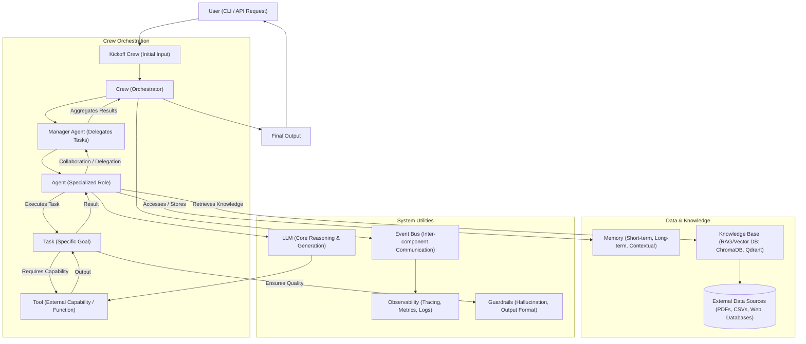

# 🚀 CrewAI: Orchestrate Autonomous AI Agents with Collaborative Intelligence

<p align="center"></p>

<p align="center">
  <a href="https://github.com/grewal16/crewAI/stargazers"></a>
  <a href="https://github.com/grewal16/crewAI/network/members"></a>
  <a href="https://github.com/grewal16/crewAI/issues"></a>
  <a href="./LICENSE"></a>
</p>

## Short Description
CrewAI is an innovative framework designed for orchestrating role-playing, autonomous AI agents to collaboratively solve complex tasks. It empowers developers to build sophisticated multi-agent systems that can reason, plan, and execute tasks by leveraging specialized tools and shared knowledge, transforming monolithic AI applications into dynamic, collaborative "crews."

## 🛡️ Project Health & Status
CrewAI is in active and robust development, demonstrated by comprehensive unit and integration tests (`tests/` directory) and a structured Continuous Integration pipeline via GitHub Actions (`.github/workflows/`). The presence of detailed issue templates and security policies further highlights a commitment to stability and maintainability. This project is built for reliability, ensuring a solid foundation for your AI-powered solutions.

## ✨ Key Features
*   **Intelligent Agent Orchestration:** Define roles, goals, and backstories for agents, enabling them to communicate, delegate, and collaborate.
*   **Flexible Task Management:** Assign tasks to agents with customizable tools and context, supporting both sequential and hierarchical workflows.
*   **Advanced Memory & Knowledge Integration:** Incorporate short-term, long-term, contextual, and external memory. Seamlessly integrate Retrieval Augmented Generation (RAG) with vector databases like ChromaDB and Qdrant.
*   **Tool Integration:** Equip agents with a wide array of tools, from web scraping (Scrapegraph, Selenium) and automation (Zapier) to specialized AI/ML functionalities (DALL-E, Code Interpreter) and diverse database interactions (MySQL, PostgreSQL, Snowflake).
*   **Observable Execution:** Gain deep insights into agent reasoning, tool usage, and task execution through integrated observability tools and tracing capabilities.
*   **Human-in-the-Loop (HITL) Support:** Design workflows that allow for human intervention and feedback, ensuring controlled and refined agent outputs.
*   **CLI for Rapid Development:** Bootstrap and manage crews, flows, and tools efficiently from the command line.
*   **LLM Agnostic:** Work with various Large Language Models, offering flexibility in choosing the best model for your needs.

## Who is this for?
CrewAI is engineered for **AI/ML Engineers, Data Scientists, Software Architects, and innovative developers** who are looking to:
*   Automate complex, multi-step workflows requiring advanced reasoning.
*   Build next-generation applications leveraging the power of collaborative AI.
*   Experiment with and deploy advanced multi-agent systems in a structured and scalable manner.
*   Enhance existing systems with intelligent automation and decision-making capabilities.

## Technology Stack & Architecture
*   **Core Language:** Python
*   **Package Management:** Poetry (`pyproject.toml`)
*   **LLM Integrations:** Designed to be LLM-agnostic, with explicit support for OpenAI, Google Gemini, and Ollama (as indicated by test cassettes).
*   **Vector Databases (RAG):** ChromaDB and Qdrant for managing and retrieving contextual knowledge.
*   **Database Interactions:** Supports various SQL databases (MySQL, PostgreSQL, Snowflake) and NoSQL (MongoDB) through specialized tools.
*   **Asynchronous Operations:** Leverages asynchronous programming for efficient task execution.
*   **CLI:** Built with a powerful command-line interface for project scaffolding and management.
*   **Testing:** Pytest for comprehensive testing, ensuring code quality and reliability.
*   **CI/CD:** GitHub Actions for automated testing and workflow management.

## 📊 Architecture & Database Schema

CrewAI's architecture centers around a dynamic orchestration of intelligent agents. The system leverages an `EventBus` to manage interactions, enabling seamless collaboration and observability across components. Agents are equipped with `Memory` and a `Knowledge Base` to inform their decision-making and task execution using various `Tools`.


```mermaid
graph TD
    User["User (CLI / API Request)"] --> Kickoff["Kickoff Crew (Initial Input)"];

    subgraph Crew Orchestration
        Kickoff --> Crew["Crew (Orchestrator)"];
        Crew --> ManagerAgent["Manager Agent (Delegates Tasks)"];
        ManagerAgent --> Agent["Agent (Specialized Role)"];
        Agent -- "Executes Task" --> Task["Task (Specific Goal)"];
        Task -- "Requires Capability" --> Tool["Tool (External Capability / Function)"];
        Tool -- "Output" --> Task;
        Task -- "Result" --> Agent;
        Agent -- "Collaboration / Delegation" --> ManagerAgent;
        ManagerAgent -- "Aggregates Results" --> Crew;
    end

    subgraph Data & Knowledge
        Agent -- "Accesses / Stores" --> Memory["Memory (Short-term, Long-term, Contextual)"];
        Agent -- "Retrieves Knowledge" --> KnowledgeBase["Knowledge Base (RAG/Vector DB: ChromaDB, Qdrant)"];
        KnowledgeBase --> ExternalDataSources[("External Data Sources (PDFs, CSVs, Web, Databases)")];
    end

    subgraph System Utilities
        Crew --> EventBus["Event Bus (Inter-component Communication)"];
        EventBus --> Observability["Observability (Tracing, Metrics, Logs)"];
        Agent --> LLM["LLM (Core Reasoning & Generation)"];
        Task -- "Ensures Quality" --> Guardrails["Guardrails (Hallucination, Output Format)"];
    end

    Crew --> FinalOutput["Final Output"];
    FinalOutput --> User;
    LLM --> Tool;
```

## ⚙️ Configuration & Deployment
CrewAI applications are highly configurable. You'll typically define your agents and tasks in Python files or YAML configurations.

1.  **Environment Variables:** Configure your LLM API keys and other external service credentials as environment variables (e.g., `OPENAI_API_KEY`, `SERPER_API_KEY`).
2.  **Install Dependencies:** Use Poetry for dependency management:
    ```bash
    poetry install
    ```
3.  **Bootstrap a New Project:**
    ```bash
    crewai create crew my_awesome_crew
    cd my_awesome_crew
    ```
4.  **Deployment:** Deploy your crew to various platforms (e.g., as an API endpoint, a serverless function) using the CLI's `deploy` command, which integrates with platforms like CrewAI+.

## ⚡ Quick Start Guide

To get started with CrewAI, follow these simple steps:

1.  **Clone the Repository:**
    ```bash
    git clone https://github.com/grewal16/crewAI.git
    cd crewAI
    ```

2.  **Install Poetry (if you don't have it):**
    ```bash
    pip install poetry
    ```

3.  **Install Dependencies:**
    ```bash
    poetry install
    ```

4.  **Activate Virtual Environment:**
    ```bash
    poetry shell
    ```

5.  **Set Up Environment Variables:**
    Create a `.env` file in your project root and add your LLM API key (e.g., for OpenAI):
    ```
    OPENAI_API_KEY='YOUR_API_KEY_HERE'
    ```

6.  **Run an Example Crew:**
    Explore the `src/crewai/cli/templates/crew` directory for a basic crew template. You can run it via the CLI:
    ```bash
    crewai run --crew my_awesome_crew
    ```

For more detailed guides and advanced configurations, refer to the `docs/` directory.

## 📜 License
This project is licensed under the MIT License. See the [LICENSE](LICENSE) file for details.