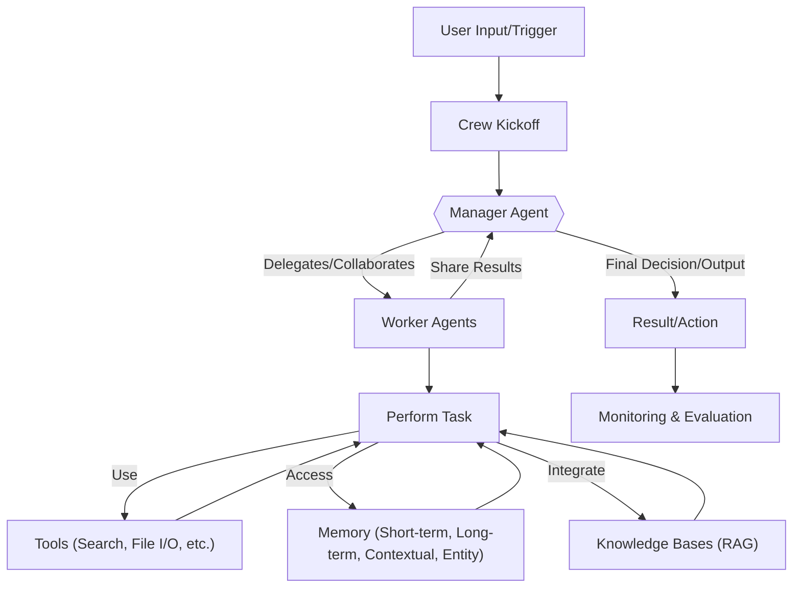

# 🚀 crewAI: Build & Orchestrate Autonomous AI Agents

<p align="center"></p>

<p align="center">
  <a href="https://github.com/grewal16/crewAI/stargazers"></a>
  <a href="https://github.com/grewal16/crewAI/network/members"></a>
  <a href="https://github.com/grewal16/crewAI/issues"></a>
  <a href="./LICENSE"></a>
</p>

## Short Description
crewAI is an innovative open-source framework designed for orchestrating role-playing autonomous AI agents. It empowers developers to build intelligent, collaborative AI teams that can execute complex tasks, automate workflows, and drive decision-making with unparalleled precision. By defining roles, goals, and backstories, crewAI enables agents to collaborate, delegate, and learn, mirroring human team dynamics for advanced problem-solving.

## ✨ Key Features
*   **Role-Playing Agents:** Define agents with distinct roles, specific goals, and compelling backstories for specialized expertise.
*   **Seamless Task Management:** Assign tasks to agents, manage their execution, and facilitate their collaboration to achieve complex objectives.
*   **AI-Powered Tool Integration:** Equip agents with a wide array of tools (e.g., web scraping, search, code execution, file operations, RAG) to interact with the environment and gather information.
*   **Flexible Workflow Orchestration:** Design intricate multi-agent workflows (sequential, hierarchical, and custom flows) for dynamic problem-solving.
*   **Memory Management:** Implement short-term, long-term, contextual, and entity memory to enhance agent reasoning and persistence.
*   **Retrieval Augmented Generation (RAG):** Integrate with vector databases like ChromaDB and Qdrant for robust knowledge retrieval and enhanced responses.
*   **Event-Driven Architecture:** Leverage event listeners and robust tracing capabilities for comprehensive observability and debugging of agent interactions.
*   **Human-in-the-Loop:** Incorporate human oversight and intervention at critical decision points.
*   **Evaluation Framework:** Tools and metrics for evaluating agent and crew performance.
*   **LLM Flexibility:** Support for various Large Language Models, including OpenAI, AWS Bedrock, Ollama, and custom LLM integrations.
*   **CLI Tools:** Command-line interface for easy project scaffolding, deployment, and management of crews and flows.
*   **Enterprise Features:** Includes features like hallucination guardrails, RBAC, agent/tool repositories, and integration triggers for enterprise-grade solutions.

## Who is this for?
crewAI is ideal for **AI engineers**, **software developers**, **researchers**, and **data scientists** who want to:
*   Build powerful, autonomous AI applications.
*   Automate complex, multi-step business processes.
*   Develop advanced research agents capable of sophisticated information gathering and synthesis.
*   Experiment with emergent AI behaviors and collaborative intelligence.
*   Create robust, scalable agentic systems for enterprise solutions.

## Technology Stack & Architecture
crewAI is built primarily in Python, leveraging the flexibility and power of modern LLMs.

*   **Core Language:** Python
*   **LLM Integrations:** OpenAI, AWS Bedrock, Ollama, Google Gemini, and extensible custom LLM support.
*   **Vector Databases (RAG):** ChromaDB, Qdrant.
*   **Workflow Engine:** Custom, event-driven orchestration layer.
*   **Tooling:** Integrations with various external APIs and custom tools for enhanced agent capabilities (e.g., web scraping, file I/O, code interpretation, database operations).
*   **Observability:** Integrates with tools like Langfuse, MLflow, Openlit, and more.
*   **CLI:** `typer` for command-line interface utilities.

## 📊 Architecture & Database Schema
The core of crewAI revolves around a dynamic orchestration of intelligent agents. Below is a simplified representation of how a crew operates:


```mermaid
graph TD
    A["User Input/Trigger"] --> B["Crew Kickoff"];
    B --> C{{"Manager Agent"}};
    C -- Delegates/Collaborates --> D["Worker Agents"];
    D --> D1["Perform Task"];
    D1 -- Use --> D2["Tools (Search, File I/O, etc.)"];
    D1 -- Access --> D3["Memory (Short-term, Long-term, Contextual, Entity)"];
    D1 -- Integrate --> D4["Knowledge Bases (RAG)"];
    D2 --> D1;
    D3 --> D1;
    D4 --> D1;
    D -- Share Results --> C;
    C -- Final Decision/Output --> E["Result/Action"];
    E --> F["Monitoring & Evaluation"];
```

## ⚡ Quick Start Guide

To get started with crewAI, follow these simple steps:

1.  **Installation:**
    ```bash
    pip install crewai
    ```

2.  **Set Up Your Environment:**
    Ensure you have your OpenAI API key (or any other LLM provider) configured in your environment variables.
    ```bash
    export OPENAI_API_KEY='YOUR_API_KEY'
    ```

3.  **Create Your First Crew:**
    You can use the CLI to quickly scaffold a new crew project:
    ```bash
    crewai create crew my_marketing_crew
    cd my_marketing_crew
    ```
    This will generate a basic project structure with example agents and tasks.

4.  **Define Agents, Tasks, and Crew:**
    Modify the `agents.py`, `tasks.py`, and `crew.py` files to define your specific roles, tasks, and how they interact.
    ```python
    # Example agent definition (from agents.py)
    from crewai import Agent

    researcher = Agent(
        role='Senior Research Analyst',
        goal='Uncover groundbreaking insights on the latest tech innovations',
        backstory='Driven by curiosity, you are a master of dissecting complex data.',
        verbose=True,
        allow_delegation=False
    )
    ```

5.  **Run Your Crew:**
    Execute your crew from the main file:
    ```bash
    python main.py
    ```
    Or use the CLI:
    ```bash
    crewai run --inputs "topic=AI in finance"
    ```

For more detailed examples and advanced configurations, refer to the official documentation within the `docs/en/` directory.

## 📜 License
This project is licensed under the MIT License. See the [LICENSE](LICENSE) file for details.