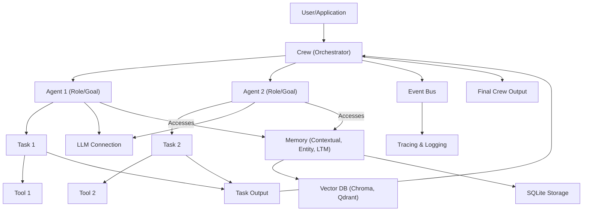

# 🚀 CrewAI

<p align="center"></p>

## Short Description
Revolutionizing AI Agent Orchestration, CrewAI empowers you to define, assign roles, and choreograph autonomous AI agents to collaboratively solve complex tasks. It transforms intricate workflows into streamlined, efficient "crews," enabling intelligent collaboration and powerful problem-solving.

## 🛡️ Project Health & Status
CrewAI is in active development and maintained with a strong focus on stability and reliability. It features robust continuous integration through GitHub Actions, ensuring consistent code quality with dedicated linting, security checks, and extensive test coverage for all core functionalities. This rigorous approach guarantees a stable and trustworthy foundation for your multi-agent AI initiatives.

## ✨ Key Features
*   **Multi-Agent Orchestration:** Seamlessly define and manage dynamic teams of AI agents working together towards a common goal.
*   **Role-Based AI Agents:** Empower agents with distinct roles, specific goals, and rich backstories for specialized expertise and autonomous decision-making.
*   **Flexible Task Management:** Assign tasks with clear descriptions, human input requirements, and defined expected outputs.
*   **Advanced Memory Management:** Leverage contextual, entity, short-term, and long-term memory capabilities, allowing agents to retain and recall information intelligently across interactions and sessions.
*   **Dynamic Tool Integration:** Easily integrate a wide array of custom and third-party tools, from web scraping and file operations to advanced AI/ML models, extending agent capabilities.
*   **Retrieval Augmented Generation (RAG):** Built-in support for sophisticated RAG workflows using vector databases like ChromaDB and Qdrant to enhance agents' knowledge with external data.
*   **Adaptive Workflow Processes:** Support for both sequential and hierarchical task execution, allowing for complex decision-making and delegation within crews.
*   **Robust Guardrails & Security:** Implement hallucination guardrails and other security measures to ensure agents operate within defined boundaries and maintain data integrity.
*   **Extensible LLM Support:** Integrate with various Large Language Models, offering flexibility and power to tailor your AI crews.
*   **CLI & Developer-Friendly APIs:** Utilize a comprehensive Command Line Interface and intuitive APIs for easy setup, configuration, and interaction.
*   **Event-Driven Tracing & Observability:** Gain deep insights into agent interactions, decision flows, and task execution through an event bus and tracing mechanisms.
*   **Experimental Evaluation Framework:** Tools to evaluate agent performance, reasoning, and output quality to continuously improve your AI workflows.
*   **Flow Visualization:** Visualize agent flows and interactions with generated HTML diagrams.

## Who is this for?
CrewAI is designed for **AI/ML Developers**, **Software Engineers**, and **Researchers** looking to build, deploy, and scale advanced multi-agent AI systems. It's ideal for those who need to automate complex business processes, perform sophisticated data analysis, generate creative content, conduct extensive research, or create intelligent autonomous systems that require collaborative problem-solving.

## Technology Stack & Architecture
*   **Core Language:** Python
*   **Package Management:** Poetry (`pyproject.toml`, `uv.lock`)
*   **LLMs:** Integrates with various Large Language Models (e.g., OpenAI, Gemini, Ollama)
*   **Vector Databases:** ChromaDB, Qdrant (for RAG)
*   **Testing Framework:** Pytest (extensive test suite)
*   **CI/CD:** GitHub Actions
*   **Persistence:** SQLite (for local memory/flow persistence)
*   **Diagramming:** Mermaid (for architectural visualization)

## 📊 Architecture & Database Schema
CrewAI enables flexible multi-agent architectures where agents collaborate using various tools, memory systems, and RAG capabilities, all orchestrated by a central crew and observable via an event bus.


```mermaid
graph TD
    A["User/Application"] --> B["Crew (Orchestrator)"];
    B --> C["Agent 1 (Role/Goal)"];
    B --> D["Agent 2 (Role/Goal)"];
    C --> E["Task 1"];
    D --> F["Task 2"];
    E --> G["Tool 1"];
    F --> H["Tool 2"];
    C --> I["LLM Connection"];
    D --> I;
    C -- "Accesses" --> J["Memory (Contextual, Entity, LTM)"];
    D -- "Accesses" --> J;
    J --> K["Vector DB (Chroma, Qdrant)"];
    J --> L["SQLite Storage"];
    B --> M["Event Bus"];
    M --> N["Tracing & Logging"];
    E --> O["Task Output"];
    F --> O;
    O --> B;
    B --> P["Final Crew Output"];
```

## ⚙️ Configuration & Deployment
CrewAI is highly configurable, primarily through environment variables and dedicated configuration files.
To set up your environment:
1.  **Environment Variables:** Define necessary API keys and settings (e.g., `OPENAI_API_KEY`, `TAVILY_API_KEY`) in a `.env` file at your project's root.
2.  **CLI Configuration:** The `crewai` CLI provides commands for managing and configuring your projects and deployments.
3.  **Deployment Options:** CrewAI supports various deployment strategies, from local execution to cloud-based services. Refer to the extensive documentation in the `docs/en/enterprise/guides/deploy-crew.mdx` for detailed guidance on deploying your crews in enterprise environments.

## ⚡ Quick Start Guide
Get your first multi-agent crew up and running in no time!

```bash
# 1. Install Poetry (recommended for dependency management)
pip install poetry

# 2. Clone the CrewAI repository
git clone https://github.com/grewal16/crewAI.git
cd crewAI

# 3. Install project dependencies
poetry install

# 4. Set up your environment variables
# Create a `.env` file in your project's root with essential API keys, e.g.:
# OPENAI_API_KEY='YOUR_OPENAI_API_KEY'
# TAVILY_API_KEY='YOUR_TAVILY_API_KEY'

# 5. Run a sample crew
# You can use the CLI to initialize a new crew and run it:
poetry run crewai init
cd your_new_crew_project
python main.py
# Or directly run an example from the repository:
python src/crewai/cli/templates/crew/main.py
```

## 📜 License
This project is licensed under the MIT License - see the [LICENSE](LICENSE) file for details.